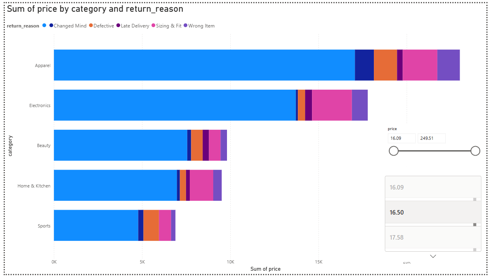

# 📊 Tech Job Market Analysis & Dashboard

An end-to-end data analysis project exploring tech job market demand, salary benchmarks, and work modes using **Python (SQLite/Pandas)**, **SQL**, and **Power BI**.

---

## 🚀 Project Overview
This project investigates tech industry hiring trends to uncover:
- The most in-demand technical skills in the market.
- Compensation benchmarks across experience levels and roles.
- The impact of work modes (Remote vs. Hybrid vs. On-Site) on salary distribution.

---

## 🛠️ Tech Stack & Tools
* **Python (Jupyter Notebook):** Data cleaning, dataset management, and SQLite integration.
* **SQL:** Analytical query writing for database insights and filtering.
* **Power BI:** Interactive executive dashboard visualization and modeling.

---

## 📈 Dashboard Preview

---

## 📁 Repository Structure
- `Tech_Job_Market_Dataset.csv`: Raw dataset containing job postings, skills, and salaries.
- `tech_job_market_eda.ipynb`: Jupyter notebook used for data preprocessing and SQLite execution.
- `tech_job_market_queries.sql`: Standalone SQL file containing schema definitions and analytical queries.
- `Tech_Job_Market_Dashboard.pbix`: Power BI file containing the full interactive data model and visual layers.
